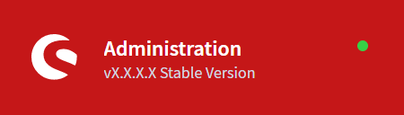

# Shopware 6 - Colorize Admin Panel

This user script helps to distinguish between different instances of a Shopware 6 installations. It colorize the top bar of the administration panel.

## Screenshots




## Requirements

* Download a user script extension for your browser like [Tampermonkey](https://www.tampermonkey.net/)
* Install this user script
* Configure the extension like in the configuration step (next one)

## Configuration

### Domain matching

You should set the domains in the @match settings for your Shopware 6 instances:

```
http*://*.myshop.com/admin*
```

### Colors

Colors can be implemented in the user comment section (yes, it's hacky!) like:

```
live.myshop.com=rgb(197, 23, 24)
stage.myshop.com=#6EDD95
local.myshop.com=rgb(24, 158, 255)
```


---
Made with <3 by Heise Webdev